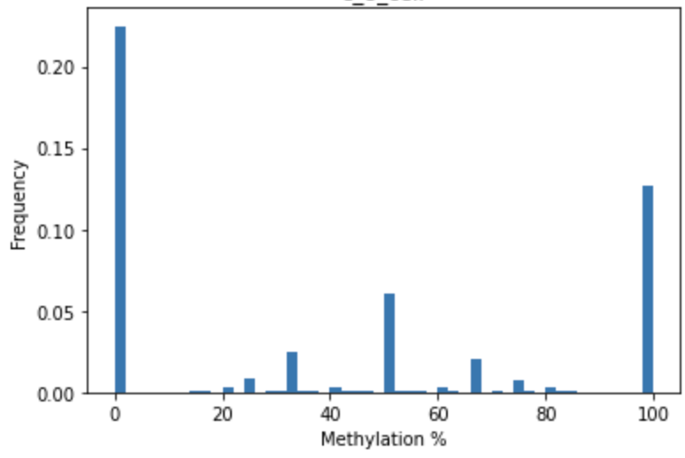

# Бордюгов Максим

[Google Colab](https://colab.research.google.com/drive/1wMpUao_wGGJNZRN17vQYpNePa-5HO6bH?usp=sharing)

## a, b

`src/deduplicate.bash`  
| Sample | region 11347700 - 11367700 | region 40185800 - 40195800 | Total % of deduplicated leftover sequences | Total % duplicated alignments removed
|-|-|-|-|-|
|8_cell| 1090 | 464 | 81.69% | 18.31% |
|epiblast| 2328 | 1062 | 97.08% | 2.92% |
|ICM| 1456 | 630 | 90.92% | 9.08% |

## d
### M - bias
#### SRR382422 - Epiblast

#### SRR5836473 - 8 Cell

#### SRR5836475 - ICM

### вывод
отображается уровент метилирования каждой позиции

## e
### гистограммы распределения метилирования цитозинов по хромосоме

#### epiblast

#### вывод
наибольший процент метилирования 100% в более чем 20% случаев

#### 8 cell

#### вывод
наименьший процент метилирования 0% в более чем 20% случаев и 100 метилирование в 15% случаев

#### ICM

#### вывод
наименьший процент метилирования: 0% в 30% случаев и 100 метилирование в менее чем 5% случаев
